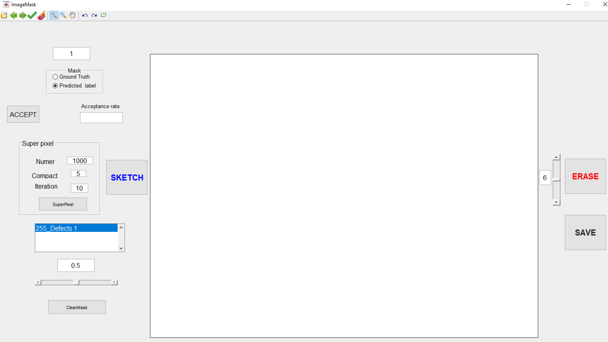

# Image_Mask_Tool

This software is developed based on MATLAB and able to create masks for image segmentation problem. In addition, it can compare results between ground truth and predicted label.

The GUI is shown as follows:

  

